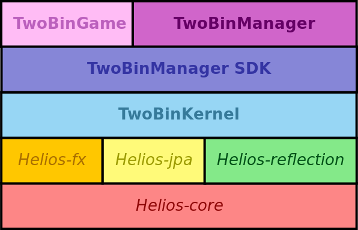

# TwoBinPack

*Scala architecture for two-dimensional packing*


## Introduction

**Operations Research** is the *science and art* of solving practical - often very difficult - problems with mathematical *elegance*, *minimalism* and *efficiency*.

**Two-dimensional packing** consists of paramount, well-known classes of problems that can arise *in a wide variety of contexts* - from warehouse stocking to cargo loading, or wood craftsmanship and page layouts, ...

For example:

* how can we dispose *a set of products in a box* to include as many items as possible? (*Knapsack* problem)

* how can we dispose *items on an endless ribbon* in order to employ the shortest possible string? (*Strip* problem)


**TwoBinPack** is a comprehensive *Scala architecture*, employing **hybrid OOP-FP techniques**, designed to *interactively tackle* the above problems and study - via dedicated, extensible *analytics tool* - how they are usually solved by people, therefore enabling both practical solving and long-term statistical analysis, to gather further insight on the topic.

Last but not least, it is **my MSc project in Computer Engineering**! :mortar_board::ghost::mortar_board:

For further information, please consult the sections below or visit [its website](http://gianlucacosta.info/TwoBinPack).


## Components



TwoBinPack consists of **3 components**:

* [TwoBinGame](https://github.com/giancosta86/TwoBinGame): a simple and intuitive ScalaFX app for *interactively solving* two-dimensional packing problem instances - both *Knapsack* and *Strip*

* [TwoBinManager](https://github.com/giancosta86/TwoBinManager): a ScalaFX app enabling users (especially *teachers* and *researchers*) to

  * create, edit, view, import and export *problem instances*

  * import, export and view *solutions*

  * consult *charts* produced by the **analytics engine**

  TwoBinManager features an extensible kernel, supporting *custom Scala plugins*.

* [TwoBinManager-sdk](https://github.com/giancosta86/TwoBinManager-sdk): a Scala library enabling the creation of plugins for TwoBinManager, as well as simplified communication with TwoBinManager's internal server

* [TwoBinKernel](https://github.com/giancosta86/TwoBinKernel): the Scala library at the heart of the other components and expressing a shared model for two-dimensional packing problems

TwoBinPack is based on **4 modules** of the [Helios](https://www.facebook.com/Helios-206962992779275/) open source library - namely:

* [Helios-core](https://github.com/giancosta86/Helios-core)

* [Helios-fx](https://github.com/giancosta86/Helios-fx)

* [Helios-jpa](https://github.com/giancosta86/Helios-jpa)

* [Helios-reflection](https://github.com/giancosta86/Helios-reflection)


## Core concepts

* **Problem** is an instance of a two-dimensional packing problem. Its main attribute is a **FrameTemplate** - defining frame parameters. It also has a unique *name* and a unique *id*, as well as on optional time limit

* **Frame** is the working area where users can play with blocks to discover solutions. It is created using a **FrameTemplate** - which states, for example, the initial size of the frame and the **FrameMode** (which can be *Knapsack* - for a static frame, or *Strip* - for an endless ribbon)

* **Solution** is a solution to a given problem, consisting in a set of **AnchoredBlock** instances, the (optional) nickname of the user that created the solution and the time elapsed

* **Problem bundle file** (*.tbprob2* extension): an XML file containing the declaration of a list of problem instances. It can be used:

  * to start a game in *TwoBinGame*

  * to exchange problems between users of TwoBinManager

* **Solution CSV file** (*.tbsol2* extension): a CSV file containing one or more solutions. It can be created:

  * by *TwoBinGame*, at the end of a game

  * by *TwoBinManager*, when exporting all the solutions related to a problem - for example, to send them to another user

* **Standard problem file** (*.txt* extension) is a plain text file describing a problem using a standard format - which is used, for example, at the [Operations Research Group](http://or.dei.unibo.it/) at the University of Bologna.


Further documents can be easily supported by creating custom importers for TwoBinManager, using the traits and classes provided by [TwoBinManager-sdk](https://github.com/giancosta86/TwoBinManager-sdk).


## Object-oriented and Functional programming

TwoBinPack leverages the **Scala programming language** and its *hybrid nature*, which brilliantly blends **Object-oriented programming** (OOP) and **Functional Programming** (FP) concepts - especially:

* Collection pipelines

* Immutability and case classes

* Tail recursion optimization

* Minimalist syntax

Such an *outstanding language* can enable *a smooth transition* from traditional OOP to a more modern, fluent and even robust **FP architecture** without losing *previous investments*.

Another paramount aspect is *the Akka-based actor model* - employed, since version 3.0, to enable elegant client/server communication between TwoBinGame and TwoBinManager.


## License and technologies

TwoBinPack is open source - released under the [GPLv3 license](https://www.gnu.org/licenses/gpl-3.0.en.html) - and employs several modern open technologies:

* [Scala](http://www.scala-lang.org/)

* [ScalaFX](http://www.scalafx.org/)

* [Akka](http://akka.io/)

* [Hibernate](http://hibernate.org/)

* [XStream](http://x-stream.github.io/)

* [Helios](https://www.facebook.com/Helios-206962992779275)

* [Aurora](https://github.com/giancosta86/Aurora)

* [MoonDeploy](http://gianlucacosta.info/moondeploy/)

* [Gradle](https://gradle.org/)

* [MoonLicense](https://github.com/giancosta86/MoonLicense)

* [Reflections](https://github.com/ronmamo/reflections)


## Special thanks

Special thanks, for their valuable advice and suggestions, to:

* [Professor Silvano Martello](http://www.or.deis.unibo.it/staff_pages/martello/cvitae.html)

* [Professor Manuel Iori](http://personale.unimore.it/rubrica/dettaglio/iorim)

* [Professor Enrico Malaguti](http://or.dei.unibo.it/staff/enrico-malaguti)

* [Dr. Maxence Delorme](http://or.dei.unibo.it/staff/maxence-delorme)


## Further references

* [TwoBinPack - Facebook page](https://www.facebook.com/TwoBinPack-234021307010796)


## Third-party licenses


### [HyperSQL](http://hsqldb.org/)

```
COPYRIGHTS AND LICENSES (based on BSD License)

For work developed by the HSQL Development Group:

Copyright (c) 2001-2016, The HSQL Development Group
All rights reserved.

Redistribution and use in source and binary forms, with or without
modification, are permitted provided that the following conditions are met:

Redistributions of source code must retain the above copyright notice, this
list of conditions and the following disclaimer.

Redistributions in binary form must reproduce the above copyright notice,
this list of conditions and the following disclaimer in the documentation
and/or other materials provided with the distribution.

Neither the name of the HSQL Development Group nor the names of its
contributors may be used to endorse or promote products derived from this
software without specific prior written permission.

THIS SOFTWARE IS PROVIDED BY THE COPYRIGHT HOLDERS AND CONTRIBUTORS "AS IS"
AND ANY EXPRESS OR IMPLIED WARRANTIES, INCLUDING, BUT NOT LIMITED TO, THE
IMPLIED WARRANTIES OF MERCHANTABILITY AND FITNESS FOR A PARTICULAR PURPOSE
ARE DISCLAIMED. IN NO EVENT SHALL HSQL DEVELOPMENT GROUP, HSQLDB.ORG,
OR CONTRIBUTORS BE LIABLE FOR ANY DIRECT, INDIRECT, INCIDENTAL, SPECIAL,
EXEMPLARY, OR CONSEQUENTIAL DAMAGES (INCLUDING, BUT NOT LIMITED TO,
PROCUREMENT OF SUBSTITUTE GOODS OR SERVICES;
LOSS OF USE, DATA, OR PROFITS; OR BUSINESS INTERRUPTION) HOWEVER CAUSED AND
ON ANY THEORY OF LIABILITY, WHETHER IN CONTRACT, STRICT LIABILITY, OR TORT
(INCLUDING NEGLIGENCE OR OTHERWISE) ARISING IN ANY WAY OUT OF THE USE OF THIS
SOFTWARE, EVEN IF ADVISED OF THE POSSIBILITY OF SUCH DAMAGE.


For work originally developed by the Hypersonic SQL Group:

Copyright (c) 1995-2000 by the Hypersonic SQL Group.
All rights reserved.

Redistribution and use in source and binary forms, with or without
modification, are permitted provided that the following conditions are met:

Redistributions of source code must retain the above copyright notice, this
list of conditions and the following disclaimer.

Redistributions in binary form must reproduce the above copyright notice,
this list of conditions and the following disclaimer in the documentation
and/or other materials provided with the distribution.

Neither the name of the Hypersonic SQL Group nor the names of its
contributors may be used to endorse or promote products derived from this
software without specific prior written permission.

THIS SOFTWARE IS PROVIDED BY THE COPYRIGHT HOLDERS AND CONTRIBUTORS "AS IS"
AND ANY EXPRESS OR IMPLIED WARRANTIES, INCLUDING, BUT NOT LIMITED TO, THE
IMPLIED WARRANTIES OF MERCHANTABILITY AND FITNESS FOR A PARTICULAR PURPOSE
ARE DISCLAIMED. IN NO EVENT SHALL THE HYPERSONIC SQL GROUP,
OR CONTRIBUTORS BE LIABLE FOR ANY DIRECT, INDIRECT, INCIDENTAL, SPECIAL,
EXEMPLARY, OR CONSEQUENTIAL DAMAGES (INCLUDING, BUT NOT LIMITED TO,
PROCUREMENT OF SUBSTITUTE GOODS OR SERVICES;
LOSS OF USE, DATA, OR PROFITS; OR BUSINESS INTERRUPTION) HOWEVER CAUSED AND
ON ANY THEORY OF LIABILITY, WHETHER IN CONTRACT, STRICT LIABILITY, OR TORT
(INCLUDING NEGLIGENCE OR OTHERWISE) ARISING IN ANY WAY OUT OF THE USE OF THIS
SOFTWARE, EVEN IF ADVISED OF THE POSSIBILITY OF SUCH DAMAGE.

This software consists of voluntary contributions made by many individuals on behalf of the
Hypersonic SQL Group.
```
